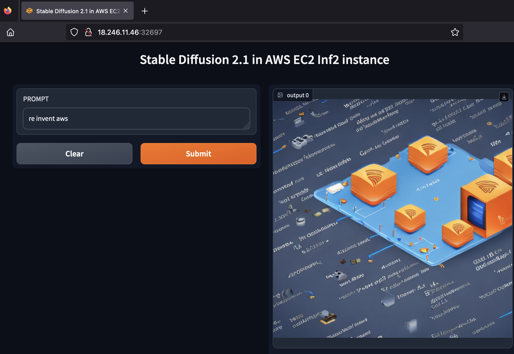

# edge_diffusion inferences
Images, audio, and video content in augmented reality (AR) applications must be generated within milliseconds. Therefore, AR applications generate digital content on-device, but quality is limited by device capabilities. However, content created on a remote server with enough resources takes sub-seconds to be served. As on-device models enrich, this trend pushes inference capabilities back to the cloud within the submillisecond timeframe that cloud edge services such as CDN and LocalZone offer.

This example shows how AR app developers can decouple content quality from hardware by hosting models like Stable Diffusion by Stability AI on a chip such as NVIDIA or Neuron-based AI accelerators as close to the user device as possible.  

You compile and deploy Stable Diffusion 2.1 on EKS in LocalZone to 1/ reduce deploy-time by caching 20GB model's graph artifacts on LocalZone with Docker multi-stage. 2/ simplify a secured network path between the user device and remote server with K8s node-port service; and finally 3/ run the model on any compatible and available AI accelerators. 

[build-time] This sample starts with the build pipeline that compiles the PyTorch code into optimized lower level hardware specific code to accelerate inference on GPU and Neuron-enabled instances. This model compiler utilizes neuron(torch_neuronx) or GPU specific features such as mixed precision support, performance optimized kernels, and minimized communication between the CPU and AI accelerator. The output Docker images are stored in regional image registers (ECR) and ready to deploy. We use Volcano, a Kubernetes native batch scheduler, to improve inference pipline orchestration.

[deploy-time] Next, EKS will instanciate the Docker image on EC2 instances launched by Karpenter based on availability, performance and cost policies. The inference endpoint uses a NodePort-based K8s service endpoint behind an EC2 security group. Each available endpoint is published to inference endpoints inventory that is pulled by the user device for ad-hoc inference.  

[run-time] KEDA will control K8s deployment size based on specific AI accelerator usage at run-time. Karpenter terminates unused pods to reclaim compute capacity.

## Setup
* [Create EKS cluster and deploy Karpenter](https://karpenter.sh/docs/getting-started/getting-started-with-karpenter/) 
* Use Service Quotas console to allocate Amazon Elastic Compute Cloud (Amazon EC2) "Running On-Demand Inf instances" and "Running On-Demand G and VT instances" limits.
* Configure NodePools to set Inferentia2 and G EC2 instances constraints 
  ```bash
  kubectl apply -f amd-neuron-provisioner.yaml
  ```
* Deploy the [Volcano CRD](https://volcano.sh/en/docs/installation/)
* Deploy [KEDA](https://keda.sh)
* Deploy [Container Insights on Amazon EKS](https://docs.aws.amazon.com/AmazonCloudWatch/latest/monitoring/Container-Insights-setup-EKS-quickstart.html)
* Deploy [NVIDIA device plugin for Kubernetes](https://github.com/NVIDIA/k8s-device-plugin)
  ```bash
  kubectl create -f https://raw.githubusercontent.com/NVIDIA/k8s-device-plugin/v0.14.1/nvidia-device-plugin.yml
  ```
* Deploy [Neuron device plugin for Kubernetes](https://awsdocs-neuron.readthedocs-hosted.com/en/latest/containers/tutorials/k8s-setup.html#tutorial-k8s-env-setup-for-neuron)
  ```bash
  kubectl apply -f k8s-neuron-device-plugin-rbac.yml
  kubectl apply -f k8s-neuron-device-plugin-ds.yml
  ```

## Build multi-arch CPU and accelerator image
The build process creates OCI images for x86-based instances. You add another build step to create OCI images for Graviton-based instances. This new build process creates a OCI image manifest list that references both OCI images. The container runtime (Docker Engine or containerd) will pull the correct platform-specific image at deployment time. To automate the OCI image build process, we use AWS CodePipeline. AWS CodePipeline starts by building a OCI image from the code in AWS CodeBuild that is pushed to Amazon Elastic Container Registry (Amazon ECR). 

* [Deploy the CI-pipeline of the Stable Diffusion image](./ci-build)

* Create Docker images that supports x86, Gravtion, Neuorn and GPUs (TBD with Volcano pipeline)
  ```bash
  kubectl apply -f sd-inf2-compile-job.yaml
  ```
## Deploy the inference pipeline
* Deploy Karpenter NodePools for Inf2 and G instances
  ```bash
  kubectl apply -f amd-nvidia-provisioner.yaml
  kubectl apply -f amd-neuorn-provisioner.yaml
  ```

* Deploy KEDA ScaledObject
TBD

* Deploy inference endpoint in a region
  ```bash
  kubectl apply -f sd-inf2-serve-deploy.yaml
  ```

* Discover the inference endpoint
  ```bash
  kubectl get svc
  ```
  e.g.,
```
  $kubectl get svc
NAME                                                          TYPE        CLUSTER-IP      EXTERNAL-IP   PORT(S)          AGE
kubernetes                                                    ClusterIP   10.100.0.1      <none>        443/TCP          64d
stablediffusion-serve-inf-56dbffc68c-zcphj-svc-18-246-11-46   NodePort    10.100.228.62   <none>        7860:32697/TCP   2d20h
```
The endpoint is `http://18.246.11.46:32697/`. Observe the AI chips utilization e.g., neuron-top

```bash
kubectl exec -it stablediffusion-serve-inf-56dbffc68c-zcphj -- neuron-top
```
Feel the prompt and enjoy the images generated. Note the the processing time. We will need that for the LocalZoe case.



* Deploy node pools on LocalZone
TBD
